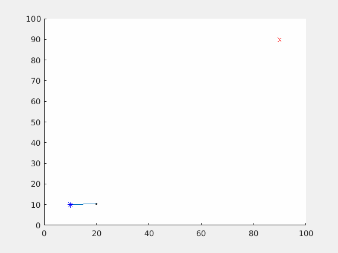
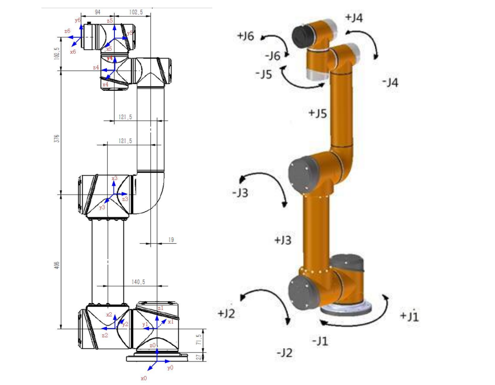

### RRT算法

RRT（Rapid-exploration Random Tree）是一种随机搜索算法，可以快速进行搜索，Random指的是搜索的方式，通过在环境中随机采样的方式探索整个环境。Tree指的是已搜索的位置通过一棵树来存储，每个位置都有自己的父节点和子节点。搜索完成的路径通常是从树的根节点到一个叶节点的路径。

常规的避障使用二维或三维RRT搜索，但是机械臂需要考虑各轴与物体的碰撞，因此需要在六维空间进行扩展，然后通过正运动解算做碰撞检测。

### 依赖

本脚本运行需要以下工具包

[geom3d](https://ww2.mathworks.cn/matlabcentral/fileexchange/24484-geom3d)

[Robotics Toolbox for MATLAB](https://petercorke.com/toolboxes/robotics-toolbox/#Downloading_the_Toolbox)

### 配置

机械臂DH参数可在 robot_DHtable.m 中设置，默认为如图机械臂模型

采样次数和步长可在 pathplanning.m 中设置，应保证足够的采样次数以获得正确的结果

### 输入

 运行 pathplanning.m ，脚本会读取input.txt的内容。input.txt中

第一行为初始位姿

第二行为目标位姿

第三行为障碍物个数

下面是障碍物的空间坐标与半径
